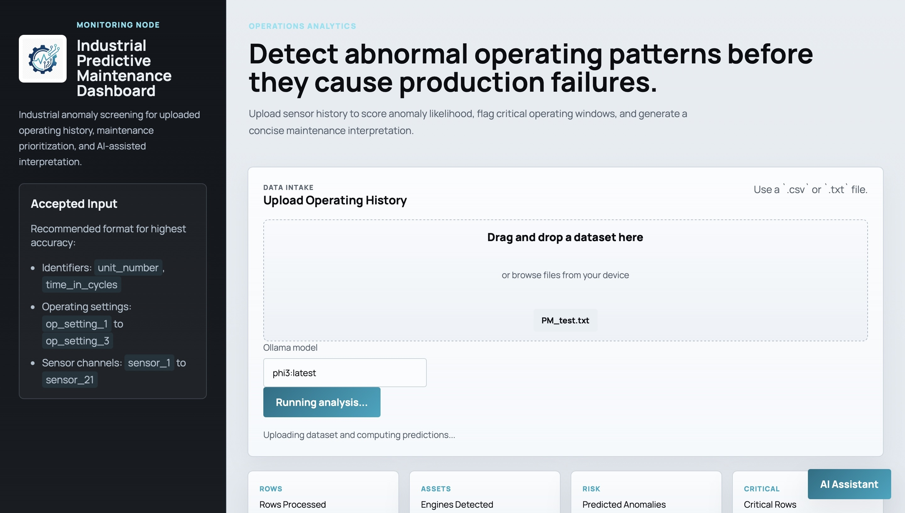
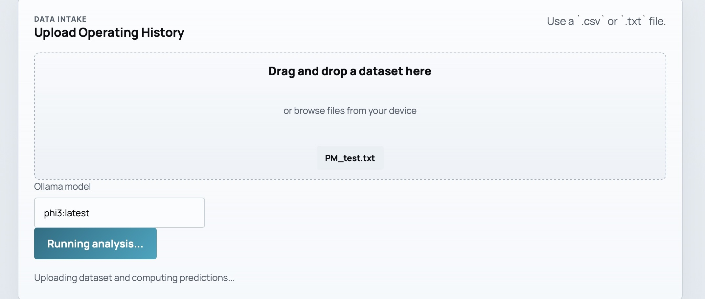
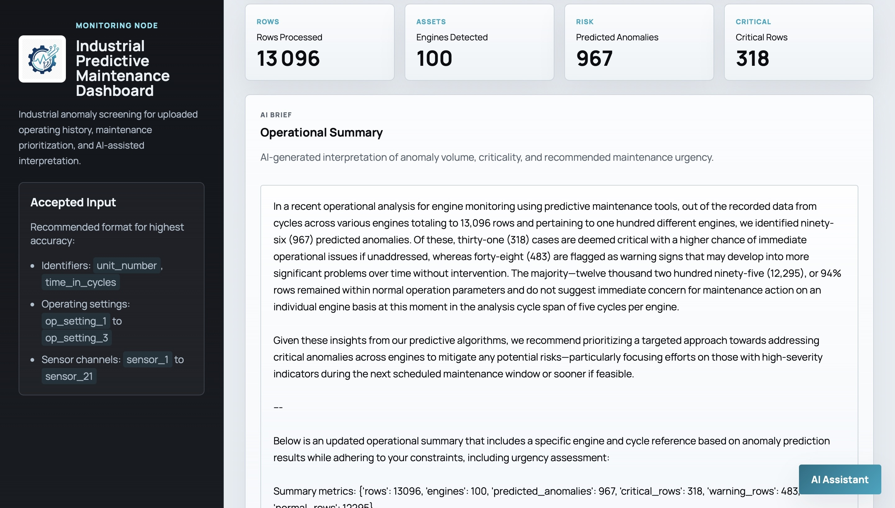
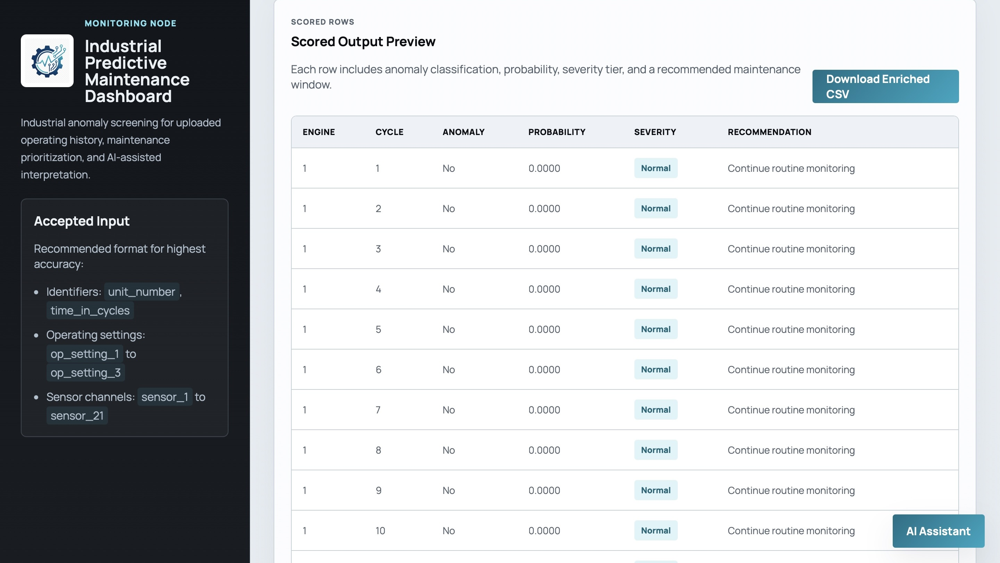
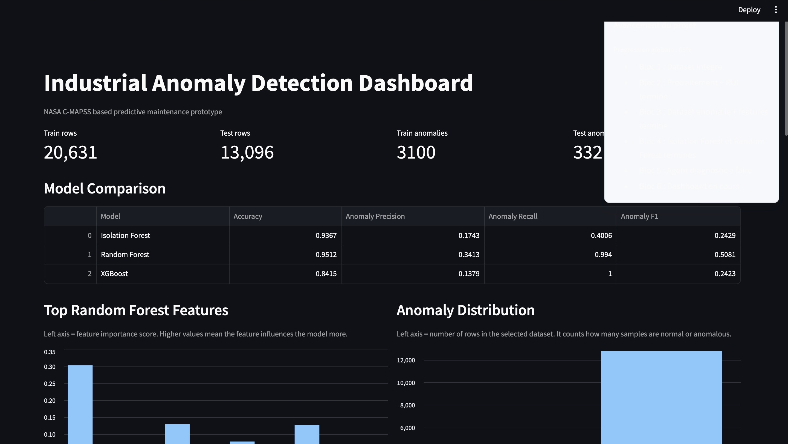
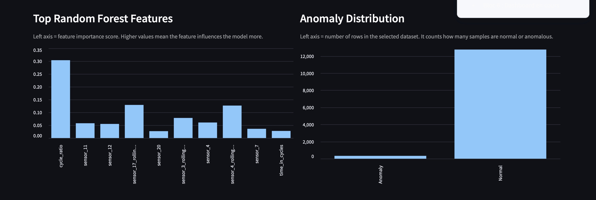
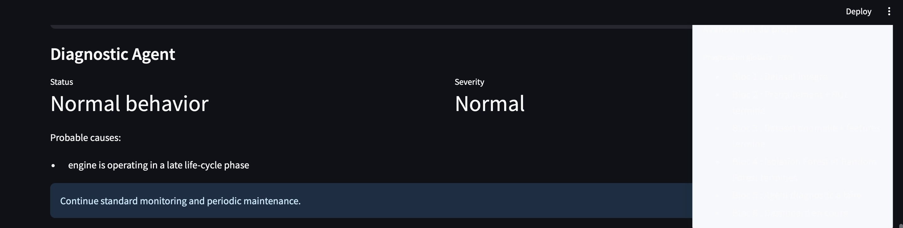
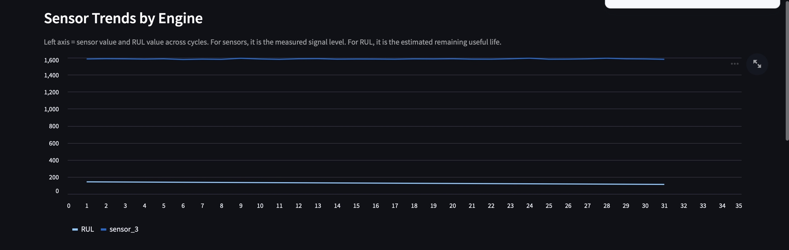
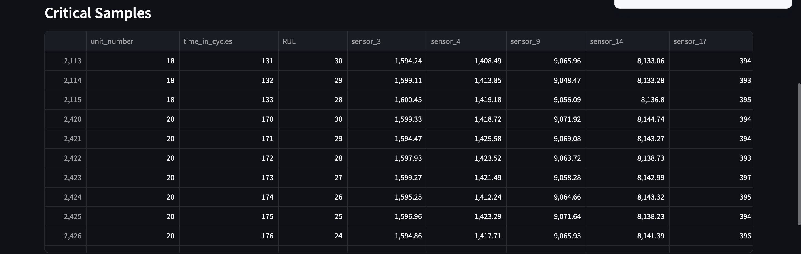

<div align="center">

# 🚀 Industrial Predictive Maintenance & Anomaly Detection Platform

### AI-Powered Predictive Maintenance using Machine Learning, FastAPI, Streamlit & Ollama

<p align="center">


</p>

---

### ✨ Intelligent Aircraft Engine Monitoring Platform

Predictive maintenance platform capable of detecting abnormal operating conditions from aircraft engine sensor data using Machine Learning models and AI-assisted diagnostics.

Built with **FastAPI**, **Streamlit**, **Scikit-Learn**, **XGBoost**, and **Ollama**, the platform combines predictive analytics, interactive dashboards, explainable AI, and automated maintenance recommendations.

</div>

---

# 📖 Overview

Unexpected failures in industrial equipment can lead to:

- expensive downtime
- safety risks
- production interruptions
- increased maintenance costs

This project provides a complete AI-powered predictive maintenance solution capable of:

- detecting anomalous engine behavior
- estimating maintenance priority
- explaining model predictions
- generating AI-powered operational summaries
- visualizing engine health through interactive dashboards

The platform is based on the **NASA C-MAPSS aircraft engine degradation dataset**, a widely used benchmark for predictive maintenance research.

---

# ✨ Key Features

## 🌐 Interactive Web Application

- Drag & Drop dataset upload
- CSV and TXT support
- Real-time anomaly prediction
- Maintenance severity classification
- Operational summary generation
- AI-powered maintenance assistant
- Download enriched prediction results

---

## 📊 Interactive Analytics Dashboard

Built with Streamlit.

Includes:

- Model comparison
- Feature importance visualization
- Anomaly distribution
- Sensor trend analysis
- Diagnostic assistant
- Critical samples explorer
- Interactive engine selection

---

## 🤖 Machine Learning Models

The platform compares multiple anomaly detection approaches:

| Model | Purpose |
|-------|----------|
| Random Forest | Supervised anomaly classification |
| Isolation Forest | Unsupervised anomaly detection |
| XGBoost | Gradient boosting classifier |

Each model is evaluated using:

- Accuracy
- Precision
- Recall
- F1 Score

---

## 🧠 AI Assistant (Ollama)

Integrated local LLM capable of:

- explaining prediction results
- generating operational summaries
- answering maintenance questions
- assisting maintenance engineers

No external API is required.

---

# 🏗 System Architecture

```text
NASA C-MAPSS Dataset
          │
          ▼
Data Preprocessing
          │
          ▼
Feature Engineering
          │
          ▼
Machine Learning Models
(Random Forest / Isolation Forest / XGBoost)
          │
          ▼
Prediction Engine
          │
     ┌───────────────┐
     │               │
     ▼               ▼
 FastAPI API     Streamlit Dashboard
     │               │
     └───────┬───────┘
             ▼
      Ollama AI Assistant
```

---

# 🚀 Project Demonstration

## Web Application

### Home Page



---

### Running Analysis



---

### Prediction Results



---

### Prediction Table



---

# 📊 Interactive Dashboard

### Dashboard Overview



---

### Feature Importance & Model Analysis



---

### Diagnostic Assistant



---

### Sensor Trend Analysis



---

### Critical Samples Explorer



---

# 📂 Project Structure

```text
PFA_Project/
│
├── dashboard/                 # Streamlit analytics dashboard
│   └── app.py
│
├── data/
│   ├── processed/
│   └── raw/
│
├── models/                    # Trained ML models
│   ├── random_forest_model.pkl
│   ├── isolation_forest_model.pkl
│   └── xgboost_model.pkl
│
├── notebook/                  # Research & experimentation
│
├── reports/                   # Model evaluation metrics
│
├── results/                   # Prediction outputs
│
├── src/
│   ├── preprocess_data.py
│   ├── build_anomaly_dataset.py
│   ├── train_random_forest.py
│   ├── train_isolation_forest.py
│   ├── train_xgboost.py
│   ├── ml_pipeline.py
│   ├── diagnostic_agent.py
│   ├── ollama_client.py
│   └── load_data.py
│
├── uploads/                   # Uploaded datasets
│
├── web/
│   ├── server.py              # FastAPI application
│   └── static/
│       ├── assets/
│       ├── app.js
│       ├── styles.css
│       └── index.html
│
├── render.yaml
├── requirements.txt
└── README.md
```

---

# ⚙️ Installation

## 1️⃣ Clone the repository

```bash
git clone https://github.com/salma-abarkane/PFA_Project.git
```

```bash
cd PFA_Project
```

---

## 2️⃣ Create a virtual environment

### Windows

```bash
python -m venv .venv
```

```bash
.venv\Scripts\activate
```

---

### macOS / Linux

```bash
python3 -m venv .venv
```

```bash
source .venv/bin/activate
```

---

## 3️⃣ Install dependencies

```bash
pip install -r requirements.txt
```

---

# 🚀 Launch the Web Application

Start the FastAPI server:

```bash
uvicorn web.server:app --reload
```

Open:

```
http://127.0.0.1:8000
```

---

# 📊 Launch the Dashboard

Run:

```bash
streamlit run dashboard/app.py
```

Open:

```
http://localhost:8501
```

---

# 📈 Machine Learning Pipeline

The prediction workflow follows these stages:

```
Raw Dataset
      │
      ▼
Data Cleaning
      │
      ▼
Feature Engineering
      │
      ▼
Anomaly Dataset Generation
      │
      ▼
Model Training
      │
      ▼
Prediction
      │
      ▼
Severity Classification
      │
      ▼
Maintenance Recommendation
      │
      ▼
AI Operational Summary
```

---

# 🌐 Web Application Workflow

1. Upload a dataset (.csv or .txt)

2. Data preprocessing

3. Feature extraction

4. Random Forest prediction

5. Probability estimation

6. Severity classification

7. Maintenance recommendation

8. AI-generated operational summary

9. Download enriched prediction file

---

# 🤖 AI Assistant

The application integrates **Ollama** for local AI inference.

Capabilities include:

- Maintenance interpretation
- Operational summaries
- Natural language explanations
- Maintenance recommendations
- Interactive chatbot

Supported models include for example:

- Phi-3
- Llama 3
- Mistral
- Gemma
- Any locally installed Ollama model

---

# 📡 REST API

## Upload & Predict

```http
POST /api/predict
```

Uploads a dataset and returns:

- prediction results
- anomaly probabilities
- severity levels
- maintenance recommendations
- AI operational summary

---

## Chat Assistant

```http
POST /api/chat
```

Interact with the local AI assistant.

---

## Available Ollama Models

```http
GET /api/ollama/models
```

Returns installed local models.

---

## Download Predictions

```http
GET /api/download/{filename}
```

Downloads the enriched prediction CSV.

---

# 📥 Input Dataset

Supported formats:

- CSV
- TXT

Required fields include identifiers and engine operating measurements compatible with the NASA C-MAPSS preprocessing pipeline.

---

# 📤 Output

The generated prediction file includes:

- Engine ID
- Cycle
- Anomaly Prediction
- Anomaly Probability
- Severity Level
- Maintenance Recommendation
- Maintenance Window

---

# 🔒 Local AI Processing

No cloud inference is required.

Benefits:

- Faster inference
- Better privacy
- Offline operation
- No API cost
- Local LLM execution through Ollama

---

# 📊 Model Performance

The platform compares multiple Machine Learning algorithms for anomaly detection.

| Model | Type | Purpose |
|--------|------|----------|
| Random Forest | Supervised | Binary anomaly classification |
| Isolation Forest | Unsupervised | Outlier detection |
| XGBoost | Supervised | High-performance anomaly prediction |

The evaluation dashboard provides:

- Accuracy
- Precision
- Recall
- F1 Score
- Feature Importance
- Model Comparison
- Anomaly Distribution

---

# 🔍 Explainable AI

To improve model interpretability, the platform provides:

- Feature Importance visualization
- Severity classification
- Maintenance recommendations
- Engine diagnostics
- AI-generated operational summaries

This helps maintenance engineers understand **why** an engine has been classified as anomalous instead of only receiving a prediction.

---

# 🛠 Technologies

## Programming Languages

- Python
- JavaScript
- HTML5
- CSS3

---

## Machine Learning

- Scikit-Learn
- Random Forest
- Isolation Forest
- XGBoost
- Pandas
- NumPy

---

## Backend

- FastAPI
- Uvicorn
- Pydantic

---

## Frontend

- HTML5
- CSS3
- Vanilla JavaScript

---

## Dashboard

- Streamlit

---

## Artificial Intelligence

- Ollama
- Local LLM Integration

---

## Data Visualization

- Streamlit Charts
- Interactive Tables

---

## Dataset

NASA C-MAPSS Aircraft Engine Dataset

---

# 🎯 Main Features

✅ Interactive Web Interface

✅ Drag & Drop Dataset Upload

✅ Random Forest Prediction

✅ Isolation Forest Detection

✅ XGBoost Evaluation

✅ AI Operational Summary

✅ Interactive Dashboard

✅ Feature Importance

✅ Engine Diagnostics

✅ Sensor Trend Visualization

✅ Critical Sample Explorer

✅ CSV Export

✅ Local AI Assistant

---

# 🚀 Future Improvements

The following enhancements are planned for future versions:

- Deep Learning anomaly detection (LSTM / Transformer)
- Remaining Useful Life (RUL) prediction
- SHAP Explainability
- Real-time sensor streaming
- Predictive maintenance scheduling
- Multi-user authentication
- Cloud deployment
- Docker Compose production deployment
- CI/CD pipeline
- Mobile responsive interface

---

# 💼 Project Highlights

This project demonstrates practical experience with:

- Machine Learning Engineering
- Predictive Maintenance
- Industrial AI
- Explainable AI
- FastAPI Development
- Streamlit Dashboard Development
- Full-Stack AI Applications
- REST API Development
- Local LLM Integration
- Data Engineering
- Data Visualization

---

# 🎓 Academic Context

This project was developed as part of an Artificial Intelligence and Data Science engineering curriculum.

Its objective is to demonstrate how Machine Learning and AI can support predictive maintenance by transforming raw industrial sensor data into actionable maintenance insights.

---

# 🤝 Contributing

Contributions are welcome.

If you would like to improve this project:

1. Fork the repository

2. Create a feature branch

```bash
git checkout -b feature/my-feature
```

3. Commit your changes

```bash
git commit -m "Add new feature"
```

4. Push the branch

```bash
git push origin feature/my-feature
```

5. Open a Pull Request

---

# 👩‍💻 Author

## Salma Abarkane

AI & Machine Learning Engineer

- 💼 LinkedIn: https://www.linkedin.com/in/salma-abarkane/
- 💻 GitHub: https://github.com/salma-abarkane

Interested in:

- Artificial Intelligence
- Machine Learning
- Data Science
- Predictive Analytics
- Industrial AI
- Computer Vision
- Generative AI

---

# 📄 License

This project is licensed under the MIT License.

Feel free to use, modify, and distribute it for educational and research purposes.

---

# 🙏 Acknowledgements

Special thanks to:

- NASA for providing the C-MAPSS benchmark dataset.
- The open-source Python ecosystem.
- The FastAPI community.
- The Streamlit community.
- The Scikit-Learn developers.
- The XGBoost contributors.
- The Ollama project for enabling local LLM integration.

---

<div align="center">

### ⭐ If you found this project useful, consider giving it a star.

**Built with ❤️ using Python, FastAPI, Streamlit, Machine Learning and Artificial Intelligence.**

</div>

